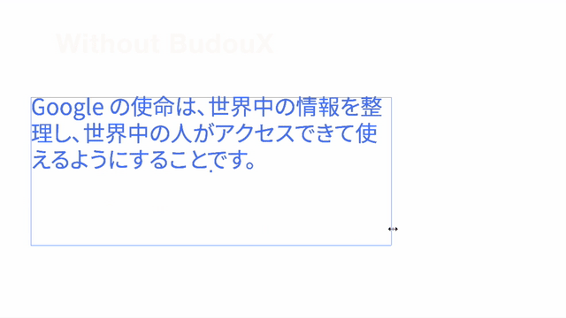

# BudouX for Adobe Illustrator
This script applies [BudouX](https://github.com/google/budoux/) to text frames in Adobe Illustrator so that phrases (or bunsetsu, 文節) are not broken at the end of lines.

## Demo

## How to use
1. Download the JavaScript file for your language from the latest release.
1. Open Adobe Illustrator.
1. Select a text frame you want to apply BudouX.
1. Go to File > Scripts > Other Script... and select the downloaded script file.

## Things to note
- The script does not preseve the style of the text.

## Author
[Shuhei Iitsuka](https://tushuhei.com/)

## Disclaimer
This is not an officially supported Google product.

